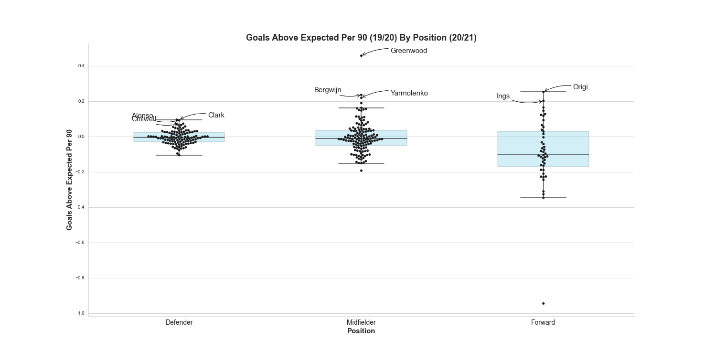

# Fantasy football visuals 20/21

## Overview

This repo contains a collection of visuals I pulled together which I hope will help when it comes to picking a fantasy football team for the upcoming EPL 2020/2021 season.

The data used to produce these visuals comes from two different sources:
1. The fantasy football data (players, positions, prices, etc.) comes from [vastav's Fantasy-Premier-League repo](https://github.com/vaastav/Fantasy-Premier-League)

2. The data for the goals/assists/xG/xA comes from the [Understat](https://understat.com/)

While the understat data used is based on 19/20 performance, I will try to update this repo around Christmas time with metrics from the 20/21 season.

If you are inrerested in how the data was scraped, or how the visuals were created, feel free to look at the jupyter notebooks included in this repo.

If you would like to explore the underlying data used to create the visuals, I have included all data files used in the `data` directory and I would advise looking at the summaries data in `data/main_data_used_for_visuals.pkl`.

## Visuals

### By position

### By cost

